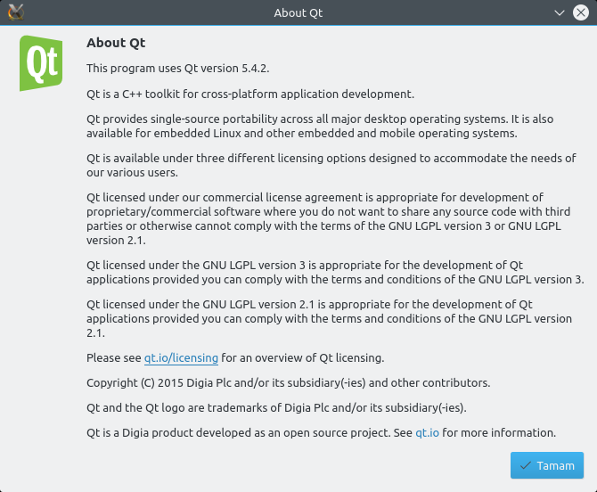

# Mesaj Kutuları

Mesaj Kutuları, kullanıcıyı bilgilendiren veya kullanıcıya bir soru soran ve cevap almak için kalıcı bir iletişim kutusu sağlar. Bu pencereleri QMessageBox sınıfı ile oluştururuz.

Bir mesaj kutusu duruma göre kullanıcıyı uyarmak için bir metin görüntüler. Bilgilendirici metin, her hangi bir uyarıyı açıklar, kullanıcıya soru sorar veya kullanıcı isterse daha detaylı bir açıklamayı görüntülemek için işlev sunar. Bir mesaj kutusu aynı zamanda özelliğine göre bir simge ve butonlar barındırır.

QMessageBox kullanıcıya mesaj kutusu göstermek için hali hazırda altı adet statik method sunar. Tabii biz yazdığımız programa göre kendi özelleştirilmiş mesaj kutularımızı da kodlayabileceğiz...

Hazır olarak sunulan mesaj kutularından birisi Qt hakkındadır. Qt ile yazılmış uygulamaların **Hakkında** menüsünde **Qt Hakkında** diye kesin bir aksiyonu bulunur. Buna tıkladığımızda ise Qt hakkında geniş bir bilgi içeren mesaj kutusu açılır. Bunu biz QMessageBox'un aboutQt\(\) statik methoduyla yaparız. Kısa bir örnek ile bu kısmı geçelim ve daha çok kullanacağımız mesaj kutularına bakalım:

```python
from PyQt5.QtWidgets import *
import sys

class AnaPencere(QMainWindow):
    def __init__(self):
        super().__init__()
        self.widget = QWidget(self)
        self.setCentralWidget(self.widget)

        self.menubar = QMenuBar(self)
        self.setMenuBar(self.menubar)

        self.hakkindaMenusu = QMenu(self)
        self.hakkindaMenusu.setTitle("Hakkında")
        self.menubar.addMenu(self.hakkindaMenusu)

        self.qtHakkindaAksiyonu = QAction(self)
        self.qtHakkindaAksiyonu.setText("Qt Hakkında")
        self.hakkindaMenusu.addAction(self.qtHakkindaAksiyonu)

        self.qtHakkindaAksiyonu.triggered.connect(self.qtHakkindaKutusuGoster)

    def qtHakkindaKutusuGoster(self):
        QMessageBox.aboutQt(self)


uygulama = QApplication(sys.argv)
pencere = AnaPencere()
pencere.show()
uygulama.exec_()
```

Daha önceki konularda gördüğümüz sınıfları örneğimiz gereği bu kodda tekrar işledik. Kodu çalıştırdığınızda küçük bir pencerede, en üstte **Hakkında** adında bir menü göreceksiniz. Ona tıklayıp **Qt Hakkında** aksiyonuna tıkladığınızda ise karşınıza Qt hakkında bilgi veren bir mesaj kutusu göreceksiniz:



İlgili kod satırı oldukça basit. Gerekli sınıfı ve statik methosu yazıyoruz ve methoda parametre olarak ana pencereyi belirten bir **self** yazıyoruz.

